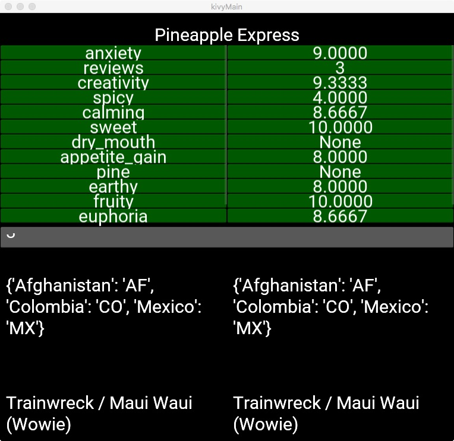
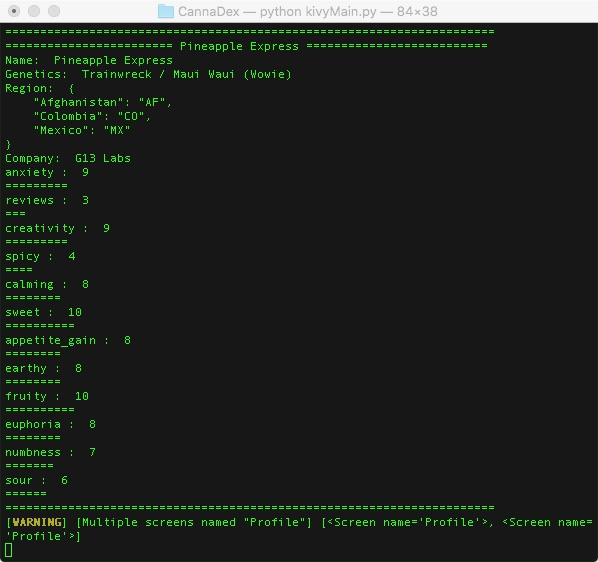

# CannaDex
A cannabis strain search engine

CannaDex is a cannabis strain search engine which allows you to look up a strain by it's name. 
It then displays an index of the effects and flavors of the strain as well as it's country of origin and it's genetic lineage.
Cannadex sources effects/flavors ratings as the average of the ratings given by reviewers on cannabisreports.com these values are out of 10. 
Cannadex also displays seed company information, again this is based on the cannabisreport database. 

## Under Contrusction
The UI and graphics are currently placeholders while the search functionality is being fully implemented.
The UI is currently written using kivy and the KVlang for easy prototyping for this reason the app must be run with kivy for the time being. This is easily accomplished, if you have kivy installed just invoke:

```
$ kivy kivyMain.py
```
## Usage

Simply search a strain by name.


Select your desired strain.


Results will then be displayed: 



Results will also be output to the console:




##To Dos

Add Photos in the strain profile. 
Do a full scale graphic design on the UI.


